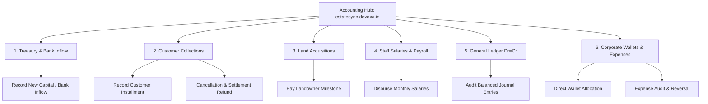

# EstateSync™ — Comprehensive Accounting & Financial Hub User Manual
**Version:** `v2.4 Production Release`  
**Portal URL:** [https://estatesync.devoxa.in](https://estatesync.devoxa.in)  
**Target Audience:** Chief Financial Officers (CFO), Head Accountants, Finance Managers, and Treasury Auditors  

---

## 📌 Executive Summary & Portal Access

EstateSync™ is an enterprise-grade, role-based Fund Management, Real Estate Accounting, and Corporate Treasury Governance system. It is designed to maintain absolute financial precision, transparent transaction auditing, strict double-entry ledger parity, and real-time cashflow visibility.

### 🌐 Live Portal Access
- **Official Live Website Link:** [https://estatesync.devoxa.in](https://estatesync.devoxa.in)
- **Login Credentials:** Access the portal using your designated organizational email address (e.g., `accounting@estatesync.local`) and your secure password.
- **Role Enforcement:** Users with the `ACCOUNTING` or `ADMIN` roles are automatically granted full audit authority to the Accounting Hub.

> [!NOTE]
> **Current Version:** You are currently using **EstateSync v2.4**.  
> **Upcoming Release (v3.0 Roadmap):** The engineering team is actively preparing the next major release (**v3.0**), which will include:
> 1. 🔐 **In-App Self-Service Password Change**: Update your login credentials directly from your profile settings.
> 2. 📝 **Personal Accountant Notes & Task Memos**: Private, persistent sticky notes and reminders attached to specific vouchers, customers, or land deals.
> 3. 🎨 **Brand-New Next-Gen UI Design**: Ultra-fluid responsive interface, modern glassmorphic widgets, enhanced typography, and dark/light contrast optimization.
> 4. 📑 **1-Click Financial Statement Export**: Instant PDF & Excel export for Balance Sheets, Trial Balances, and General Ledgers.

---

## 🏗️ Core Financial Architecture & Principles

EstateSync adheres strictly to international accounting standards and Indian statutory compliance:
1. **Double-Entry Equilibrium ($\text{Debits} = \text{Credits}$):**  
   Every transaction posted in EstateSync automatically creates balanced journal line items. The system mathematically prevents any single-sided entry from being written.
2. **Idempotency Safeguard:**  
   Every state-altering payout, collection, or fund transfer is protected by a unique `Idempotency-Key`. This guarantees that network lags or accidental double-clicks never cause duplicate bank transfers or double ledger postings.
3. **Real-Time Treasury Liquidity Tracking:**  
   Funds are compartmentalized into **Liquid Bank Funds (1010)** and **Cash in Hand (1020)**. Payouts cannot exceed available liquidity.

---

## 🚀 Getting Started: Logging In & Navigating

### Step 1: Secure Login
1. Open your web browser and navigate to [https://estatesync.devoxa.in/login](https://estatesync.devoxa.in/login).
2. Enter your **Email Address** (e.g., `accounting@estatesync.local`).
3. Enter your **Password**. Click the eye icon (`Show`) to verify accuracy.
4. Click **Sign In to Dashboard**.
5. Upon successful authentication, your token is securely verified and you are redirected to `/dashboards/accounting`.

### Step 2: Understanding the Accounting Header & Navigation Island
At the top of the Accounting Hub, you will find:
- **Financial Status Badge:** Shows `Full Audit Authority` with an active pulsing indicator.
- **Horizontal Scrollable Navigation Island:** Contains smooth auto-centering navigation tabs for all 6 accounting modules:
  1. 🏛️ **Bank Inflow & Treasury** (`PRD §4.1`)
  2. 👥 **Customer Collections** (`PRD §19`)
  3. 📍 **Land Acquisitions** (`PRD §20`)
  4. 🇮🇳 **Staff Salaries & Payouts** (`Treasury Sync`)
  5. ⚖️ **General Ledger** (`Dr = Cr`)
  6. 💼 **Wallets & Expenses** (`Corporate`)
- Use the **Left** and **Right arrow controls** on the navigation island to navigate across modules easily on any screen size.

### Step 3: Top-Level Key Metrics Cards
Located right below the header, these 4 real-time KPI cards give you an instantaneous snapshot of organizational health:
1. **Total Corporate Treasury (Liquid):** Real-time combined balance of all linked corporate bank accounts.
2. **Total Customer Inflows:** Aggregate revenue collected across all active property projects.
3. **Total Land & Vendor Payouts:** Cumulative disbursements made toward property acquisition agreements.
4. **Active Employee Wallet Balances:** Sum of circulating corporate expense funds distributed to managers, sales executives, and site staff.

---

## 📖 Feature-by-Feature User Guide



---

### MODULE 1: Bank Inflow & Corporate Treasury

**Purpose:** Manage corporate capital infusions, bank-to-bank transfers, external loans, director investments, and monitor real-time treasury cashflow.

#### Features & Layout:
- **Cashflow Summary Cards:**
  - **Total Inflow (Green):** Total capital deposited into corporate accounts.
  - **Total Outflow (Red):** Total capital disbursed out of treasury accounts.
  - **Net Cashflow (Blue):** Net liquid movement ($\text{Inflow} - \text{Outflow}$).
- **Cashflow Filter & Search Bar:** Filter by `All Movements`, `Inflows Only`, or `Outflows Only`, or search by UTR, Bank Name, or Description.
- **Cashflow Records Table:** Displays Date, Type, Bank Account, Direction, Reference/UTR Number, Amount, and Balance after transaction.

#### How to Record a New Bank Inflow:
1. Click the blue button: **`+ Record Bank Inflow`** at the top right of the Treasury module.
2. A secure modal dialog will open. Fill out the required details:
   - **Deposit Amount (₹):** Enter the exact deposited amount (e.g., `5000000`).
   - **Receiving Bank Name:** Select or enter your corporate bank (e.g., `HDFC Bank Ltd - Corporate Current A/C` or `ICICI Bank Ltd`).
   - **Corporate Account Number:** Enter the corporate account number.
   - **Inflow Type:** Choose from:
     - `CAPITAL_INFUSION` (Director / Partner capital investment)
     - `DIRECTOR_LOAN` (Unsecured borrowing)
     - `BANK_LOAN` (Commercial loan disbursement)
     - `REFUND_RECEIVED` (Vendor refund)
     - `OTHER_INFLOW` (Miscellaneous)
   - **Payment Mode:** Select `RTGS`, `NEFT`, `IMPS`, `CHEQUE`, or `CASH`. *(If CASH is selected, Bank and UTR requirements are waived).*
   - **UTR / Bank Reference Number:** Enter the bank transaction reference number for auditing.
   - **Transaction Date:** Select the date when funds hit the bank account.
   - **Narration / Description:** Add accounting notes (e.g., *"Tranche 1 Equity infusion for Phase 2 land acquisition"*).
3. Click **`Post Inflow to Treasury`**.
4. **Automated Impact:**
   - Corporate Treasury balance is credited immediately.
   - Double-entry journal entry is posted: **Debit Bank (1010)**, **Credit Capital/Equity or Liability**.
   - Transaction is timestamped and recorded in the audit log.

---

### MODULE 2: Customer Collections & Booking Schedules

**Purpose:** Manage residential and commercial property buyers, log installment payments, track outstanding balances, view payment histories, and process contract cancellations.

#### Features & Layout:
- **Customer Portfolio Grid:** Shows every registered customer with:
  - Customer Name, Phone, Email, PAN/CNIC
  - Assigned Property & Unit Number (e.g., *"Unit B-402, Green Valley Enclave"*)
  - Total Contract Value (₹)
  - Total Amount Paid to Date (₹)
  - Remaining Balance Due (₹)
  - Payment Completion Progress Bar (0% - 100%)
- **Filter Tabs:** `All Customers`, `Active Bookings`, `Fully Paid`, `Cancelled / In Settlement`.

#### How to Record a Customer Installment Payment:
1. Locate the customer card in the list (or use the Search bar by name, phone, or unit).
2. Click the green button: **`Record Payment`**.
3. In the modal, verify the **Total Contract Value** and **Remaining Balance Due**.
4. Enter the payment details:
   - **Payment Amount (₹):** Enter the installment received. *(The system validates that amount cannot exceed remaining balance due).*
   - **Payment Mode:** Choose `NEFT`, `RTGS`, `IMPS`, `CHEQUE`, `UPI`, or `CASH`.
   - **Source Bank / Remitter Details:** (e.g., *"Customer SBI Account"*).
   - **Destination Account:** Corporate Treasury HDFC A/C (1010) or Cash in Hand (1020).
   - **UTR / Cheque / Transaction Number:** Enter the transaction reference.
   - **Date of Payment:** Date when payment was received.
5. Click **`Confirm & Post Payment`**.
6. **Automated Impact:**
   - Customer's `Total Paid` increments; `Balance Due` decrements.
   - Instant double-entry posting: **Debit Corporate Bank (1010)**, **Credit Customer Accounts Receivable / Revenue (4010)**.
   - A printable, auditable customer receipt is generated with a unique Transaction ID.

#### How to Process a Customer Cancellation & Settlement:
1. If a customer cancels their booking, locate the customer and click **`Cancel Booking & Settle`**.
2. Review the total amount paid by the customer.
3. Enter the **Forfeiture / Cancellation Deduction (%)** agreed as per the builder-buyer agreement (e.g., `10%`).
4. The system automatically computes:
   - **Deduction Amount:** Retained by company as cancellation revenue.
   - **Refund Payable:** Total paid minus deduction.
5. Select the disbursement bank account and enter the refund UTR number.
6. Click **`Approve Cancellation & Disburse Refund`**.
7. **Automated Impact:**
   - Property unit status is reset to `AVAILABLE` for resale.
   - Refund is disbursed out of Treasury.
   - Journal entry balances: **Debit Revenue/Receivables**, **Credit Treasury Bank**, **Credit Cancellation Fee Income**.

---

### MODULE 3: Land & Property Acquisitions

**Purpose:** Comprehensive accounting for raw land purchases, vendor milestones, developer consideration, and asset capitalization.

#### Features & Layout:
- **Acquisition Portfolio:** Overview of every acquired estate parcel with:
  - Title & Location (e.g., *"Sector 88 Palm County - 12.5 Acres"*)
  - Landowner / Vendor Name & Contact
  - Total Agreed Consideration (₹)
  - Amount Disbursed to Owner (₹)
  - Balance Liability Remaining (₹)
  - Milestone Progress Tracker (Token Paid -> Agreement Executed -> Registry Completed -> Possession Taken).

#### How to Record a Property Payout to a Landowner:
1. Locate the property parcel in the list.
2. Click **`Record Owner Payout`**.
3. The system checks **Current Treasury Liquid Balance** in real time to ensure corporate funds are sufficient before allowing disbursement.
4. Enter payout details:
   - **Payout Amount (₹):** Enter milestone payment (e.g., `2500000`).
   - **Payment Mode:** Select `RTGS`, `NEFT`, `CHEQUE`, or `BANK_TRANSFER`.
   - **Paid From Account:** Select the corporate source account (e.g., `Corporate Bank 1010`).
   - **UTR / Reference Number:** Mandatory bank transfer UTR.
   - **Milestone Notes:** (e.g., *"Release of 2nd registry installment following mutation verification"*).
   - **Date of Payout:** Date of bank execution.
5. Click **`Disburse Milestone Payout`**.
6. **Automated Impact:**
   - Corporate Treasury is debited in real time.
   - Property Land Asset account is capitalized: **Debit Fixed Assets / Land Inventory (1510)**, **Credit Corporate Treasury Bank (1010)**.
   - Remaining liability to the landowner is automatically updated.

---

### MODULE 4: Staff Salaries & Payroll Synchronization

**Purpose:** Complete oversight of organizational payroll, salary voucher generation, monthly salary disbursements, and automatic treasury synchronization.

#### Features & Layout:
- **Month Selector:** Switch between payroll cycles (e.g., `2026-09`, `2026-08`, `2026-07`).
- **Payroll KPI Summary:**
  - **Total Payroll Expense:** Total monthly salary liability across all active staff.
  - **Paid to Date:** Amount already disbursed for the selected month.
  - **Pending Payouts:** Outstanding salaries awaiting payment.
  - **Active Employees:** Headcount covered under the payroll run.
- **Employee Salary Register Table:**
  - Employee ID, Name, Designation, Department
  - Monthly Base Salary (₹)
  - Allowances & Deductions
  - Net Payable Amount
  - Payment Status (`PAID` with green checkmark or `PENDING` with clock icon).

#### How to Disburse Employee Salaries:
1. Select the current payroll month from the dropdown.
2. In the employee table, locate staff marked `PENDING`.
3. Click the blue **`Pay Salary`** button.
4. Review the computed salary slip:
   - Base salary, attendance adjustments, tax deductions, and net payable.
5. Select payout channel (`Bank Transfer`, `NEFT`, or `Cash`).
6. Enter the payout UTR / Reference ID and confirmation date.
7. Click **`Confirm & Disburse Salary`**.
8. **Automated Impact:**
   - Employee status transitions to `PAID` with payment date recorded.
   - Treasury funds are debited.
   - Double-entry posting: **Debit Salary Expense (5010)**, **Credit Corporate Bank (1010)**.

---

### MODULE 5: Double-Entry General Ledger & Accounts

**Purpose:** The central audit engine of EstateSync. Inspect every debited and credited rupee across all five fundamental accounting classifications (Assets, Liabilities, Equity, Revenue, Expenses).

#### Features & Sub-Tabs:
The General Ledger view has two operational sub-tabs:

#### Sub-Tab A: Journal Entries
- Displays a sequential record of every journal transaction generated by the system.
- **Balanced Badge:** A prominent badge at the top shows:
  - `✓ Balanced (Debit = Credit)` in green when the ledger satisfies mathematical parity.
  - `⚠️ Ledger Imbalance` in red if any discrepancy occurs (strictly prevented by design).
- Each journal entry card displays:
  - **Journal Number & Timestamp**
  - **Narration / Description**
  - **Idempotency Key & Source Document Reference**
  - **Line-by-Line Breakdown Table:**
    - Account Code & Account Title (e.g., `1010 - Corporate HDFC Bank`)
    - Account Category (`ASSET`, `EXPENSE`, `LIABILITY`, etc.)
    - Debit Amount (₹)
    - Credit Amount (₹)
  - Bottom verification line verifying `Total Debits == Total Credits`.

#### Sub-Tab B: Chart of Accounts (COA)
- Displays all established ledger accounts with their standardized codes:
  - **1000s - Assets:** Corporate Bank (1010), Cash in Hand (1020), Accounts Receivable (1030), Land Assets (1510).
  - **2000s - Liabilities:** Accounts Payable (2010), Landowner Consideration Payable (2020), Director Loans (2030).
  - **3000s - Equity:** Share Capital (3010), Retained Earnings (3020).
  - **4000s - Revenue:** Property Sales Revenue (4010), Customer Booking Inflows (4020), Forfeiture Income (4030).
  - **5000s - Expenses:** Land Development (5005), Salaries (5010), Marketing & Sales (5020), Office Operations (5030).
- Live running balance shown for every account.

---

### MODULE 6: Corporate Wallets, Expense Auditing & Transaction Ledger

**Purpose:** Comprehensive governance over circulating employee wallet balances, corporate expense claims, line-item receipt validation, administrative reversals, and audit logs.

#### Part 1: User Wallet Balances (`UserWalletLedger`)
- View real-time wallet balances of every user across the company (Operations Managers, Sales Agents, Site Supervisors).
- **Direct Fund Allocation:**
  - Click **`Direct Fund Allocation`** to push operational funds directly from Treasury into an employee's wallet.
  - Select Employee -> Enter Amount -> Enter Reason (e.g., *"Site inspection fuel and client entertainment advance"*).
  - Pushed instantly; employee can spend against this balance.
- **Manual Balance Adjustment:**
  - Click **`Adjust Balance`** next to any employee card.
  - Specify Credit or Debit, adjustment delta, and mandatory administrative justification for the audit trail.

#### Part 2: Corporate Expense Audit & Line-Item Reversals (`ExpenseList`)
- Under the **`All Expenses`** sub-tab:
  - Review every expense submitted by staff across the company.
  - View Employee Name, Category (Travel, Fuel, Marketing, Legal, Utilities), Amount, GST/Tax breakdown, and Date.
  - Click **`View Receipt`** to inspect the scanned physical bill or photo attachment.
- **Executing an Administrative Expense Reversal:**
  - If an expense was filed with an invalid receipt, incorrect amount, or duplicate voucher:
  - Click the red **`Reverse Expense`** button on that record.
  - A modal will prompt for the **Reversal Reason** (e.g., *"Duplicate taxi receipt submitted - denied by audit"*).
  - Click **`Confirm Reversal`**.
  - **Automated Impact:**
    - Expense is flagged as `REVERSED`.
    - Employee's wallet is credited back the exact reversed amount.
    - An offsetting journal entry is created: **Debit Employee Wallet (1040)**, **Credit Expense Account (50xx)**.
    - Permanent audit entry is saved showing which accountant performed the reversal and why.

#### Part 3: Global Transaction Ledger (`TransactionLedger`)
- Under the **`Transaction Ledger`** sub-tab:
  - Comprehensive, tamper-evident log of every financial transaction in EstateSync.
  - Displays: Transaction ID, Timestamp, Type (`ALLOCATION`, `EXPENSE`, `REVERSAL`, `COLLECTION`, `DEPOSIT`), User, Source/Destination, Amount, and Idempotency Reference.
  - Includes quick search and pagination.

---

## 🔒 Security, Auditability & Compliance Protocols

1. **Role-Based Access Control (RBAC):**  
   Only users assigned the `ACCOUNTING` or `ADMIN` roles can view, create, or alter accounting records. Other roles (Sales, Managers) only see their own operational wallets.
2. **Permanent Audit Trail:**  
   Every login, payment recording, reversal, and balance adjustment is logged to the `AuditLog` table with IP address, user email, timestamp, and before/after state snapshots.
3. **Session Timeout & Inactivity Safeguards:**  
   Authentication tokens expire automatically after 24 hours. If your session expires, you will be prompted to securely log in again.
4. **Number Input Scroll Protection:**  
   Accidental mouse-wheel scrolling while hovering over monetary input boxes is automatically neutralized to prevent accidental value alterations.

---

## 🛠️ Quick Troubleshooting Guide

| Issue Encountered | Likely Cause | Recommended Resolution |
| :--- | :--- | :--- |
| **"Invalid Credentials" on Login** | Incorrect password or email spelling. | Verify your email (e.g., `accounting@estatesync.local`) and re-enter your password. Ensure Caps Lock is off. |
| **"Cannot exceed remaining balance"** | Payment entered is greater than customer's pending dues. | Check the customer's `Balance Remaining` card. Enter an amount equal to or less than the balance due. |
| **"Insufficient Treasury Liquidity"** | Land payout exceeds available bank balance. | Check your Liquid Treasury funds under Module 1. Record a bank inflow before attempting large vendor disbursements. |
| **Expense receipt won't open** | Pop-up blocker active in browser. | Allow pop-ups for `https://estatesync.devoxa.in` in your browser settings. |
| **Screen not updating after action** | Browser cached response. | Click the **`Refresh`** icon on the module table or press `Ctrl + Shift + R` (Hard Refresh). |

---

## 🔮 Upcoming in Release v3.0

The development roadmap for **EstateSync v3.0** is already underway. Here is what is arriving in the next release:

```
┌────────────────────────────────────────────────────────────────────────┐
│                        ESTATESYNC ROADMAP v3.0                         │
├──────────────────────────┬─────────────────────────────────────────────┤
│ 🔐 Password Change       │ Self-service in-app password update dialog  │
│ 📝 Personal Notes Hub    │ Private sticky notes for reconciliations    │
│ 🎨 Next-Gen UI System    │ Streamlined design, modern glassmorphism    │
│ 📊 PDF/Excel Exporter    │ Export P&L, Balance Sheet, Ledger in 1-click│
│ 🔔 Real-Time Webhooks    │ Instant SMS/Email alerts for large inflows  │
└──────────────────────────┴─────────────────────────────────────────────┘
```

---

*EstateSync™ • A Product of Devoxa Technologies Pvt. Ltd.*  
*© 2026 All rights reserved. Registered Trademark ®*
