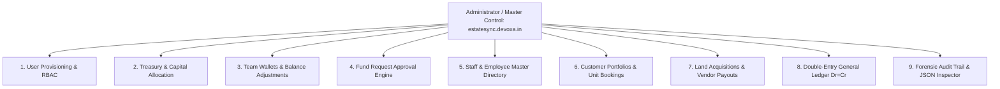

# EstateSync™ — Comprehensive Administrator & Master Control User Manual
**Version:** `v2.4 Production Release`  
**Portal URL:** [https://estatesync.devoxa.in](https://estatesync.devoxa.in)  
**Target Audience:** System Administrators, Managing Directors, Chief Operating Officers (COO), Executive Leadership, and IT/Audit Leads  

---

## 📌 Executive Summary & Master Control Access

EstateSync™ is an enterprise-class Fund Management, Real Estate Accounting, and Corporate Treasury Governance platform. The **Admin Hub** represents the central command and master authority of the entire ecosystem. 

As an Administrator, you possess unilateral oversight across all operational divisions—including corporate treasury, user account provisioning, employee HR master records, customer unit collections, land acquisitions, department wallet allocations, and forensic audit logging.

### 🌐 Live Portal Access
- **Official Live Website Link:** [https://estatesync.devoxa.in](https://estatesync.devoxa.in)
- **Login Credentials:** Sign in using your registered administrative email (e.g., `admin@estatesync.local`) and your master password.
- **Master Control Clearance:** Users with the `ADMIN` role have unrestricted access across every dashboard tab:
  - 🛡️ **Admin Hub** (`/dashboards/admin`)
  - 🏛️ **Accounting Hub** (`/dashboards/accounting`)
  - ⚡ **Operations Hub** (`/dashboards/manager`)
  - 👥 **Employees Master** (`/dashboards/employees`)
  - 💼 **My Wallet & Approvals** (`/dashboards/wallet`)

> [!NOTE]
> **Current Version:** You are operating on **EstateSync v2.4**.  
> **Upcoming Release (v3.0 Roadmap):** The engineering team is currently finishing development on the next major milestone (**v3.0**), which includes:
> 1. 🔐 **In-App Password Management**: Self-service password change for all users plus administrative one-click password reset capabilities for staff accounts.
> 2. 📝 **Personal Admin Notes & Sticky Memos**: Private pinboards and internal administrative commentary on transactions, employee files, and land agreements.
> 3. 🎨 **Brand-New Next-Gen UI Design**: Ultra-fluid responsive layouts, glassmorphic status surfaces, enhanced data tables, and advanced dark/light visual modes.
> 4. 📑 **1-Click Executive Data Export**: Bulk export of User Directories, Audit Logs, and Comprehensive Balance Sheets into formatted Excel and PDF formats.

---

## 🏗️ Core Administrative Governance Principles



1. **Unilateral Master Authority:**  
   The Administrator can initiate, approve, adjust, or reverse any financial or operational transaction across the organization.
2. **Immutable Audit Logging:**  
   Every single action—from user logins and fund allocations to balance adjustments and status changes—is automatically captured with actor IP, timestamp, and before/after state diffs (`oldValues` vs `newValues`).
3. **Double-Entry Financial Integrity:**  
   Capital cannot be created out of thin air. Every direct allocation debits the Corporate Treasury and credits the employee wallet, keeping the organization's trial balance in exact mathematical parity ($\text{Debits} = \text{Credits}$).
4. **Idempotency Protection:**  
   All capital distribution and user creation actions are protected by cryptographic idempotency tokens, preventing accidental duplicate disbursements.

---

## 🚀 Getting Started: Logging In & Navigating the Admin Suite

### Step 1: Logging In
1. Open your browser and navigate to [https://estatesync.devoxa.in/login](https://estatesync.devoxa.in/login).
2. Enter your administrative email (e.g., `admin@estatesync.local`).
3. Enter your password. (Toggle the eye icon to verify spelling).
4. Click **Sign In to Dashboard**.
5. Once authenticated, the system automatically redirects you to the **Admin Hub** at `/dashboards/admin`.

### Step 2: The Top Navigation Island & Multi-Dashboard Access
The persistent top navigation header allows administrators to seamlessly switch between operational lenses:
- **Admin Hub:** Primary command center for capital allocation, user creation, and audit trails.
- **Operations Hub:** Operational view for departmental project approvals and field expenses.
- **Accounting Hub:** Full double-entry general ledger, customer installments, and landowner payouts.
- **Employees:** Master workforce directory, designations, and salary structures.
- **My Wallet & Approvals:** Personal corporate wallet and personal expense submission.

### Step 3: Top-Level Admin Metric Cards
At the top of `/dashboards/admin`, four real-time KPI metrics give an instantaneous bird's-eye view:
1. **Total Corporate Treasury (Liquid):** Aggregate unencumbered capital available across corporate bank accounts.
2. **Total Capital Allocated:** Total funds currently circulating inside employee and manager wallets.
3. **Pending Approval Requests:** Number of open fund requests and unapproved staff claims requiring executive sign-off.
4. **Total System Users:** Total active registered user accounts across all organizational roles.

---

## 📖 Feature-by-Feature Administrator Operating Guide

---

### FEATURE 1: Administrative Operations Hub (Allocation & User Provisioning)

Located immediately below the KPI stats, this interactive container features a **segmented toggle control** that lets you operate in four distinct modes:
1. **Direct Fund Allocation**
2. **Register New User**
3. **Adjust & Audit Wallets**
4. **Side-by-Side (Both)**: Displays Fund Allocation and User Registration side by side for rapid onboarding.

```
[ Coins: Direct Fund Allocation ] [ UserPlus: Register New User ] [ Sliders: Adjust & Audit Wallets ] [ Columns2: Side-by-Side (Both) ]
```

---

### FEATURE 2: User Account Provisioning & Role-Based Access Control (RBAC)

**Component:** `UserRegistrationForm`  
**Purpose:** Create and activate system credentials for new employees, managers, accountants, and field agents.

#### Available System Roles:
- **`ADMIN` (Master Control):** Complete access to all financial, operational, and audit controls.
- **`MANAGER` (Operations Head):** Reviews team fund requests, tracks project field wallets, and approves subordinate claims.
- **`ACCOUNTING` (Finance & Treasury):** Manages bank inflows, customer installments, land acquisition milestones, payroll, and double-entry journals.
- **`SALES` (Sales Executive):** Access to Customer Portfolio and personal sales expense wallet.
- **`MARKETING` (Marketing Executive):** Campaign expense management and personal marketing wallet.
- **`EMPLOYEE` (Standard Staff):** Personal operational wallet and expense claim submission.

#### How to Register a New Staff Account:
1. In the Administrative Operations Hub, select **`Register New User`** (or **`Side-by-Side`**).
2. Fill out the registration form:
   - **Full Name:** Enter employee's formal name (e.g., *"Rajesh Verma"*).
   - **Corporate Email:** Enter unique login email (e.g., *"rajesh.verma@estatesync.local"*).
   - **Initial Password:** Set a secure initial password (minimum 6 characters).
   - **Assign System Role:** Select appropriate role from the dropdown (`ADMIN`, `MANAGER`, `ACCOUNTING`, etc.).
3. Click **`Provision Account`**.
4. **Automated System Impact:**
   - The user account is instantly saved with bcrypt password encryption.
   - An individual corporate wallet is **automatically initialized** for this user with a starting balance of ₹0.00.
   - The action is permanently recorded in the Security Audit Log (`USER_REGISTER`).
   - The user can immediately log in at [https://estatesync.devoxa.in](https://estatesync.devoxa.in) with their assigned credentials.

---

### FEATURE 3: Direct Treasury Fund Allocation

**Component:** `DirectFundAllocationForm`  
**Purpose:** Push operational funds directly from the Corporate Treasury into any employee or manager wallet without requiring a prior request.

#### How to Allocate Capital to Staff:
1. In the Administrative Operations Hub, select **`Direct Fund Allocation`**.
2. Fill out the allocation parameters:
   - **Target Staff / Manager:** Select recipient from the searchable dropdown list.
   - **Allocation Amount (₹):** Enter the amount or click one of the quick-amount pill buttons (`₹5,000`, `₹10,000`, `₹25,000`, `₹50,000`, `₹1,00,000`).
   - **Disbursement Mode:** Choose **`LIQUID`** (Bank Transfer from Treasury Account 1010) or **`CASH`** (Cash in Hand from Account 1020).
   - **Purpose / Description:** Provide the organizational justification (e.g., *"Advance disbursement for site office electrical wiring and materials"*).
3. Click **`Allocate Capital to Wallet`**.
4. **Automated System Impact:**
   - Corporate Treasury is immediately debited by the entered amount.
   - The recipient employee's wallet balance increases instantly in real time.
   - A double-entry journal transaction is posted: **Debit Employee Wallet (1040)**, **Credit Corporate Treasury Bank (1010)**.
   - A permanent record is created in the **Global Transaction Ledger** with a unique `Idempotency-Key`.

---

### FEATURE 4: Circulating Wallet Governance & Balance Adjustments

**Component:** `UserWalletLedger` & `AdjustWalletBalanceModal`  
**Purpose:** Monitor every circulating wallet balance across the enterprise and perform administrative manual corrections.

#### Features & Oversight:
- **Wallet Overview Grid:** Displays every user's Name, Role, Email, **Available Balance (₹)**, **Total Allocated (₹)**, and **Total Spent (₹)**.
- **Action Buttons on Each Card:**
  - **`Allocate Funds`:** Opens direct allocation dialog pre-selected to this user.
  - **`Adjust Balance`:** Opens the administrative balance correction modal.

#### How to Perform an Administrative Balance Adjustment:
1. Locate the employee wallet card you wish to adjust.
2. Click the **`Adjust Balance`** button.
3. In the modal:
   - **Current Wallet Balance:** Displayed prominently for reference.
   - **Adjustment Type:** Select **`CREDIT`** (Add funds) or **`DEBIT`** (Deduct funds).
   - **Adjustment Delta (₹):** Enter the amount to add or subtract.
   - **Mandatory Administrative Reason:** Enter the official audit justification (e.g., *"Adjustment for unspent field advance returned via cash receipt #4819"*).
4. Click **`Confirm Adjustment`**.
5. **Automated System Impact:**
   - Employee wallet balance updates immediately.
   - Compensating double-entry ledger lines are generated.
   - Audit trail records the administrator ID, timestamp, adjustment delta, and justification.

---

### FEATURE 5: Organization-Wide Fund Requests & Approval Queue

**Component:** `FundRequestList` (`type="all"`)  
**Purpose:** Review, approve, or reject capital requests submitted by staff and department managers across the organization.

#### Understanding Request Statuses:
- **`PENDING` (Yellow Badge):** Awaiting executive review.
- **`APPROVED` (Green Badge):** Funds disbursed to requester's wallet.
- **`REJECTED` (Red Badge):** Request declined with audit reason.

#### How to Approve or Reject a Fund Request:
1. In the Admin Dashboard, locate the **All Organization Fund Requests** section.
2. Review the incoming request card:
   - Requester Name, Designation, and Department.
   - Requested Amount (₹) and Category (Site Development, Client Hospitality, Fuel, Legal, etc.).
   - Justification / Business Purpose.
   - Supporting quote or receipt attachment (if provided).
3. **To Approve:**
   - Click the green **`Approve`** button.
   - The system validates that Corporate Treasury has sufficient liquidity.
   - Funds are instantly credited to the requester's wallet, and Corporate Treasury is debited.
4. **To Reject:**
   - Click the red **`Reject`** button.
   - Enter an administrative rejection comment (e.g., *"Please provide itemized quote from vendor before resubmitting"*).
   - The request is closed with no fund movement.

---

### FEATURE 6: Workforce Master Directory (`/dashboards/employees`)

**Component:** `EmployeeList` & `EmployeeModal`  
**Purpose:** Manage organizational human capital, employee records, job designations, salary structures, and system user account linkings.

#### Administrative Capabilities:
1. **Add New Employee (`+ Add Employee`):**
   - Personal Details: First Name, Last Name, Official Email, Phone, Date of Birth.
   - Employment Details: Employee Code (e.g., `EMP-0042`), Department (Sales, Engineering, Accounts, Legal, Management), Designation, Employment Type (`FULL_TIME`, `PART_TIME`, `CONTRACT`), Date of Joining, Work Location.
2. **Link Employee to User Login Account (`Link User`):**
   - Binds an HR employee profile to an existing login credential in the `User` table, allowing automated salary sync and wallet identity binding.
3. **Configure Employee Salary Structure (`Edit Salary`):**
   - Set Monthly Base Salary (₹), Fixed Allowances (HRA, Travel, Performance), and Deductions (PF, TDS).
4. **Archive Employee Profile (`Archive`):**
   - Safely deactivates an employee profile upon departure while preserving historical payroll and expense auditing.

---

### FEATURE 7: Customer Portfolios & Unit Booking Oversight

**Component:** `CustomerPortfolioList`  
**Purpose:** Executive supervision of real estate buyers, payment milestones, collections, and contract cancellations.

#### Key Admin Operations:
- **Register New Customer (`+ Register Customer`):**
  - Name, Contact, PAN, Aadhaar, Permanent Address.
  - Assign Property & Unit Number.
  - Set Total Contract Consideration (₹).
- **Record Customer Installment (`Record Payment`):**
  - Log buyer installment payments received via RTGS, Cheque, or Cash.
  - Automatically posts double-entry receipt into Treasury Bank.
- **Process Booking Cancellation & Financial Settlement (`Cancel Booking & Settle`):**
  - Compute agreed forfeiture fee (%) retained by the company.
  - Disburse net refund from Treasury and release the unit back to inventory.

---

### FEATURE 8: Land & Property Acquisition Governance

**Component:** `PropertyAcquisitionList`  
**Purpose:** Complete management of raw land purchases, parcel sizes, owner agreements, milestone payouts, and asset capitalization.

#### Key Admin Operations:
- **Create New Property Asset (`+ Add Property`):**
  - Property Title (e.g., *"Green Valley Phase 2 - 15.4 Acres"*).
  - Location, Landowner Name, Contact Details.
  - Total Agreed Consideration (₹).
- **Disburse Landowner Payout (`Record Owner Payout`):**
  - Authorize milestone disbursements (Token, Registry, Possession).
  - Validates liquid treasury reserves before allowing payment release.
  - Automatically capitalizes land asset in the General Ledger.

---

### FEATURE 9: Double-Entry General Ledger & Real-Time Balance Proof

**Component:** `GeneralLedgerView`  
**Purpose:** Executive financial verification that organizational books satisfy strict mathematical double-entry equilibrium.

#### What to Verify as an Administrator:
- **Balanced Badge:** Look at the badge at top right:
  - `✓ Balanced (Debit = Credit)`: Confirms zero-sum perfection across all company accounts.
  - `⚠️ Ledger Imbalance`: Alerts to any data discrepancy (mathematically barred by system schema).
- **Journal Entries Tab:** Inspect chronologically generated journal vouchers with account numbers, debit/credit breakdowns, and idempotency references.
- **Chart of Accounts Tab:** Audit real-time running balances across Assets (1000s), Liabilities (2000s), Equity (3000s), Revenue (4000s), and Expenses (5000s).

---

### FEATURE 10: Forensic Security Audit Trail & JSON Inspector

**Component:** `AuditLogViewer`  
**Purpose:** Complete compliance logging and forensic tracking of every sensitive state mutation across EstateSync.

#### How to Inspect System Activity:
1. Scroll to the **Security & Audit Trail** section at the bottom of the Admin Hub.
2. **Filter by Action:** Use the action dropdown to isolate specific events:
   - `USER_LOGIN` / `USER_REGISTER`
   - `FUND_DIRECT_ALLOCATE` / `FUND_REQUEST_APPROVE`
   - `EXPENSE_CREATE` / `EXPENSE_REVERSE`
   - `CUSTOMER_PAYMENT_RECORD` / `PROPERTY_PAYMENT_RECORD`
   - `SALARY_PAYMENT_DISBURSED`
3. **Inspect Detailed JSON Payload:**
   - Click the **`View Details`** icon on any audit log row.
   - An interactive terminal window opens displaying:
     - **Actor Email & User ID**
     - **Client IP Address & User Agent**
     - **Entity Type & ID**
     - **Full State Snapshot:** Displays exact `oldValues` before mutation and `newValues` after mutation.

---

## 🔒 Security Best Practices for Administrators

1. **Protect Master Credentials:** Never share admin login credentials. Create individual `ADMIN` accounts for co-directors rather than sharing a single login.
2. **Periodic Wallet Audits:** Routinely inspect the `UserWalletLedger` to ensure circulating balances in field wallets match operational needs.
3. **Verify UTR References:** When reviewing large bank inflows or landowner payouts, cross-check the entered UTR against corporate bank statements.
4. **Session Discipline:** Always click **`Logout`** (red button at top right) when stepping away from your terminal. Sessions automatically time out after 24 hours.

---

## 🛠️ Quick Troubleshooting Guide for Admins

| Issue Encountered | Root Cause | Administrator Resolution |
| :--- | :--- | :--- |
| **"User already exists" during registration** | The email address entered is already registered in the system. | Verify if the staff member already has an account. Use a different email or update their role. |
| **"Insufficient Treasury Balance" when allocating** | Corporate Treasury liquid funds are lower than requested amount. | Navigate to Treasury module and record an incoming capital infusion before distributing funds. |
| **Employee cannot see Admin Hub** | User is assigned a non-admin role (`MANAGER`, `SALES`, etc.). | Check user's assigned role in the workforce directory and upgrade to `ADMIN` if authorized. |
| **Accidental double click on allocation** | Network lag caused multiple clicks. | Idempotency engine automatically rejects duplicate submissions within the same window. Only one allocation will be posted. |
| **Audit log shows unfamiliar IP** | Remote access or dynamic mobile network IP. | Review the action performed in the JSON inspector. If suspicious, reset user password immediately. |

---

## 🔮 What's Coming in Release v3.0

```
┌────────────────────────────────────────────────────────────────────────┐
│                     ESTATESYNC ADMIN ROADMAP v3.0                      │
├──────────────────────────┬─────────────────────────────────────────────┤
│ 🔐 Admin Password Reset  │ Reset forgotten passwords for any staff     │
│ 📝 Master Sticky Notes   │ Private admin annotations on deals & staff  │
│ 🎨 Next-Gen UI System    │ Modern glassmorphism, responsive data grid  │
│ 📊 1-Click Data Exporter │ Bulk export all tables to Excel / PDF       │
│ 🚨 Real-Time Webhooks    │ Instant WhatsApp/Email alerts on allocations│
└──────────────────────────┴─────────────────────────────────────────────┘
```

---

*EstateSync™ • A Product of Devoxa Technologies Pvt. Ltd.*  
*© 2026 All rights reserved. Registered Trademark ®*
