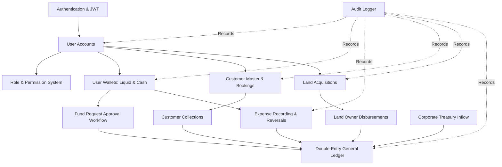

# EstateSync: Current System Architecture & Domain Map

**Company**: AG Homes India PVT. LTD.  
**System**: EstateSync Real Estate CRM, Treasury & Double-Entry Financial Engine  
**Document**: Phase 0 Discovery — System Map  
**Status**: ACTIVE BASELINE

---

## 1. High-Level Architectural Overview

EstateSync is a full-stack real-estate management, fund governance, CRM, and financial accounting platform built with:
- **Backend**: Node.js / Express 5 REST API
- **Database**: PostgreSQL with Prisma ORM
- **Frontend**: Next.js (App Router), React, TailwindCSS, Lucide Icons, SWR
- **Accounting Principle**: Real-time Double-Entry General Ledger (Debit = Credit invariant)
- **Treasury Model**: Single Source of Truth Corporate Treasury (`admin@estatesync.local` Treasury Wallet)

---

## 2. Discovered Domain Map

```
┌─────────────────────────────────────────────────────────────────────────┐
│                           ESTATESYNC ARCHITECTURE                       │
└─────────────────────────────────────────────────────────────────────────┘

   [ Client Layer: Next.js Web App ]
                   │
                   ▼ (HTTP / JSON / JWT Bearer)
   [ Express API Gateway & Security ]
   ├── Helmet & CORS
   ├── Express Rate Limit
   ├── JWT Auth Middleware (verifyJWT)
   ├── Role-Based Access Control (checkPermission + Live DB Fallback)
   └── Idempotency Guard (idempotencyMiddleware)
                   │
   ┌───────────────┴──────────────────────────────────────────────┐
   │                                                              │
   ▼                                                              ▼
[ Core Operational Domains ]                       [ Financial & Accounting Engine ]
 1. Authentication & Users                          1. Corporate Treasury (1010)
    └── User, Role, RolePermission, Permission         └── Capital Infusion, Bank Inflow
 2. Field Wallets & Hierarchy                       2. Double-Entry General Ledger
    └── Wallet (Cash & Liquid balances)                └── Account, JournalEntry, JournalLine
    └── FundRequest (Multi-tier approvals)          3. Sub-Ledgers:
 3. Office & Field Expenses                            ├── Customer Ledger (4010 Revenue)
    └── Expense, ExpenseCategory                       ├── Property Assets Ledger (1510 Assets)
    └── Expense Reversal                               └── Staff Float Ledger (1020/1030 Wallets)
 4. CRM & Customer Master (PRD §19)                 4. Cross-Module UTR / Reference Validator
    └── Customer (Commercials & Bookings)              └── referenceValidator.js
    └── CustomerPayment (Collections & Receipts)    5. Single Source of Truth Treasury
    └── Cancellation & Refund Settlement Flow          └── treasuryHelper.js
 5. Land Acquisition Management (PRD §20)
    └── PropertyAcquisition (Parcels, Khata/Plot)
    └── PropertyPayment (Owner Payouts)
                   │
   ┌───────────────┴──────────────────────────────────────────────┐
   │                                                              │
   ▼                                                              ▼
[ Cross-Cutting Shared Services ]                  [ Data Persistence Layer ]
 1. Audit Logging (logAudit)                        1. PostgreSQL Database
 2. Normalization Engine (identifierHelper)         2. Prisma ORM Client
 3. Validation Suite (CI Test Suite)
```

---

## 3. Current Module Interconnections



---

## 4. Planned Payroll Attachment Point (Future Domain)

The upcoming **Employee + Monthly Salary + Payroll** module will be completely additive and attach to existing shared infrastructure:

```
[ EXISTING USERS ] ────────(Optional Link)───────► [ NEW: EMPLOYEES MASTER ]
                                                          │
                                                          ▼
                                              [ NEW: SALARY STRUCTURES ]
                                                          │
                                                          ▼
                                              [ NEW: MONTHLY PAYROLL RUN ]
                                                          │
                   ┌──────────────────────────────────────┴──────────────────────────────────────┐
                   │                                                                            │
                   ▼                                                                            ▼
     [ REUSE: General Ledger ]                                                   [ REUSE: Corporate Treasury ]
     • Dr: Salary Expense (5060)                                                 • Cr: Bank / Cash (1010)
     • Cr: Salary Payable (2010)                                                 • Dr: Salary Payable (2010)
                   │                                                                            │
                   └──────────────────────────────────────┬─────────────────────────────────────┘
                                                          │
                                                          ▼
                                                [ REUSE: Audit Log ]
                                                • logAudit(PAYROLL_APPROVE)
                                                • logAudit(SALARY_PAY)
```
