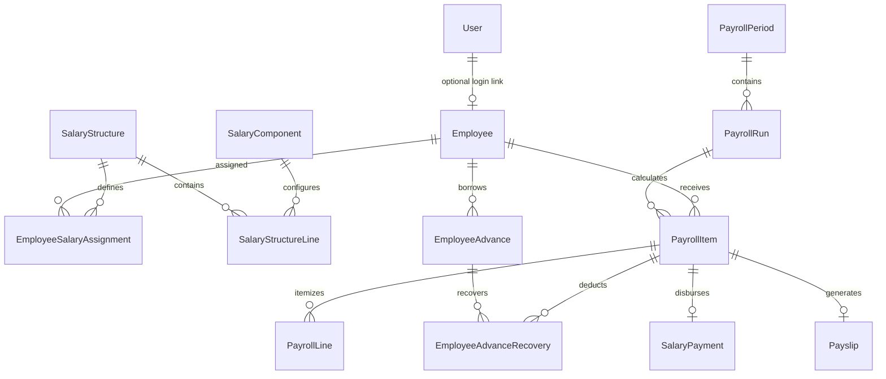

# EstateSync: Database & Schema Discovery Report

**Document**: Phase 0 Discovery — Database & Schema Analysis  
**Status**: ACTIVE BASELINE

---

## 1. Database & ORM Technology Profile

- **Database Engine**: PostgreSQL
- **ORM / Query Engine**: Prisma ORM (`@prisma/client` v5.22.0)
- **Engine Type**: Binary engine with custom client path `../src/prisma-client`
- **Primary Key Strategy**: UUID v4 across all models (`id String @id @default(uuid())`)
- **Foreign Key Convention**: CamelCase referencing parent model ID (`userId`, `roleId`, `customerId`, `propertyId`)
- **Timestamp Standard**:
  - Creation: `createdAt DateTime @default(now())`
  - Update: `updatedAt DateTime @updatedAt`
- **Financial Precision Standard**:
  - Currency: `Decimal @db.Decimal(15, 2)` (handles values up to ₹999,999,999,999.99 with exact 2-decimal precision)
  - Land/Plot Area: `Decimal @db.Decimal(10, 2)`
- **Deletion Strategy**:
  - Soft Status Enums (`status: 'ACTIVE' | 'CANCELLED' | 'RECORDED' | 'REVERSED' | 'PENDING' | 'APPROVED' | 'REJECTED'`)
  - No physical hard deletions on historical records.

---

## 2. Core Entity Distinction: User vs Employee

### The Problem
In many legacy systems, employees are equated to login users. In real-estate operations at AG Homes India PVT. LTD., many staff members (site guards, drivers, field labor, peons, office assistants) **do NOT need and should NOT have** software login credentials.

### Discovered Model vs Future Model
- **Current `User` Table**: Represents system authenticatable identities with email, password hash, role ID, and operational field wallet.
- **Future `Employee` Table**: Represents physical personnel on company payroll.
- **Relationship**: `User (0..1) <─────── (1) Employee` (Optional one-to-one foreign key `userId String? @unique`).

---

## 3. Conceptual Future Additive Schema (No Migrations in Phase 0)

The following tables are planned as **additive models** for future implementation phases:

1. **`Employee`**: Master record containing employeeCode, name, contact, department, designation, joiningDate, pan, aadhaar, bankDetails, status, and optional `userId`.
2. **`SalaryComponent`**: Earnings and deductions catalog (BASIC, HRA, DA, SPECIAL_ALLOWANCE, PF_EMPLOYEE, ESI_EMPLOYEE, TDS, PROFESSIONAL_TAX).
3. **`SalaryStructure` & `SalaryStructureLine`**: Template defining formula and fixed/percentage values.
4. **`EmployeeSalaryAssignment`**: Versioned linkage between an employee and active salary structure with CTC/Gross.
5. **`PayrollPeriod`**: Fiscal calendar month tracking (e.g. `2026-04`, status: `OPEN`, `LOCKED`, `CLOSED`).
6. **`PayrollRun`**: Batch execution instance for a period (e.g. `REGULAR_MONTHLY`, `SUPPLEMENTARY`).
7. **`PayrollItem`**: Individual employee monthly pay computation record (Gross, Total Deductions, Net Pay, Advance Recovery, Status).
8. **`PayrollLine`**: Detailed breakdown of each earning and deduction for an individual's pay slip.
9. **`EmployeeAdvance` & `EmployeeAdvanceRecovery`**: Tracking of principal loan/advance disbursed and monthly recovered installments.
10. **`SalaryPayment`**: Execution voucher for bank/cash salary transfer, linked to Corporate Treasury and Journal Entry.
11. **`Payslip`**: Snapshot record for employee download and distribution.

> **Zero Conflicts Found**: No existing table or column in `backend/prisma/schema.prisma` conflicts with or duplicates any of these planned entities.
