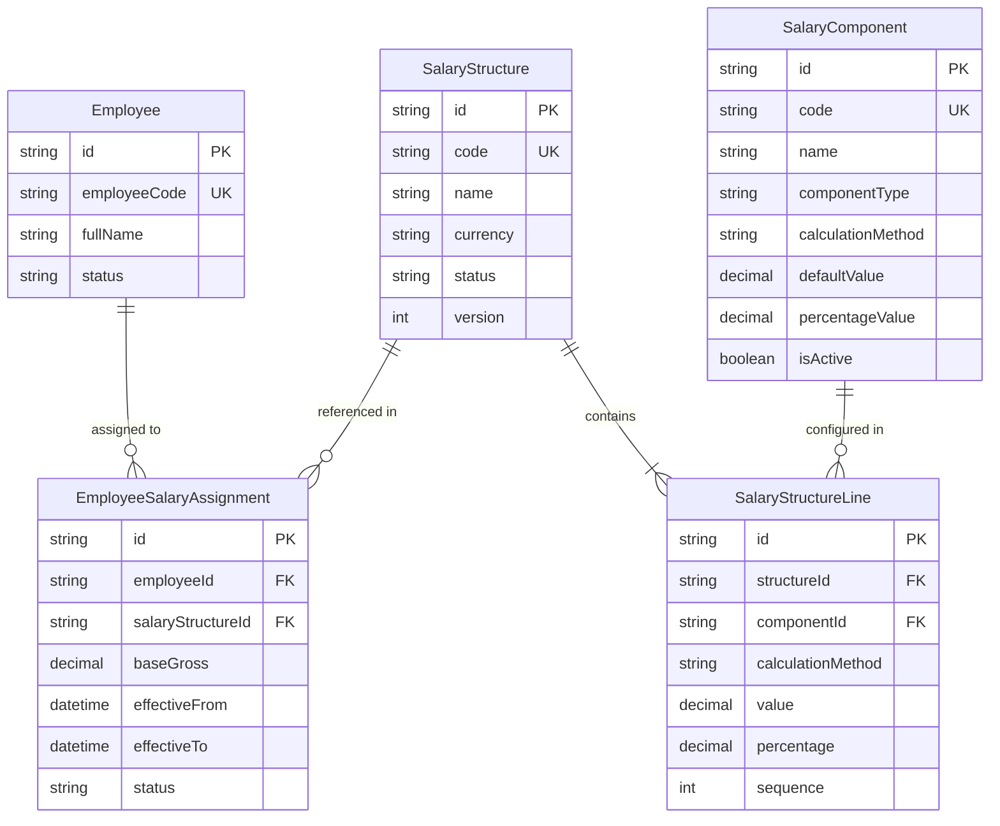

# Phase 2: Database Schema & Relational Specifications

**Document**: Phase 2 Implementation — PostgreSQL / Prisma Data Architecture  
**Status**: ACTIVE & MIGRATED

---

## 1. Relational Schema Architecture

---

## 2. Integrity & Deletion Constraints

1. **`SalaryComponent`**: `onDelete: Restrict` on `SalaryStructureLine` prevents dropping components that are referenced by existing structures.
2. **`SalaryStructure`**: `onDelete: Restrict` on `EmployeeSalaryAssignment` prevents deleting structures that are assigned to employees.
3. **`Employee`**: `onDelete: Restrict` on `EmployeeSalaryAssignment` preserves historical compensation records even if employee records undergo archival.
