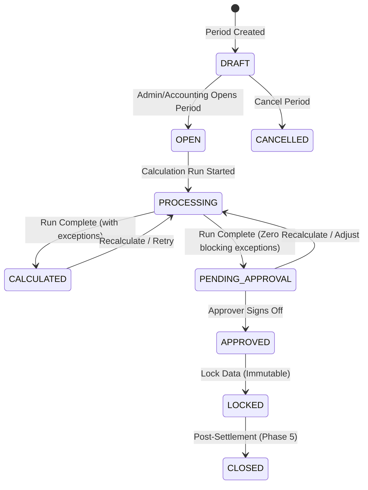

# Phase 3: Monthly Payroll Period Specifications

**Document**: Phase 3 Implementation — Payroll Period Lifecycle & State Machine  
**Status**: IMPLEMENTED & LOCKED

---

## 1. Concept & Scope

A **Payroll Period** defines a monthly financial payroll cycle (e.g. August 2026).
EstateSync enforces **exactly one active period per calendar year and month** (`@@unique([year, month])`).

---

## 2. Period Lifecycle State Machine

---

## 3. Transition Invariant Rules

1. **Unique Month Constraint**: An attempt to create two periods for the identical `[year, month]` is rejected with `HTTP 409 Conflict`.
2. **Open Transition**: A period cannot accept calculation runs until transitioned to `OPEN`.
3. **Immutability Barrier**: Once a period transitions to `APPROVED` or `LOCKED`, no further recalculations, adjustments, or line item mutations are permitted.
