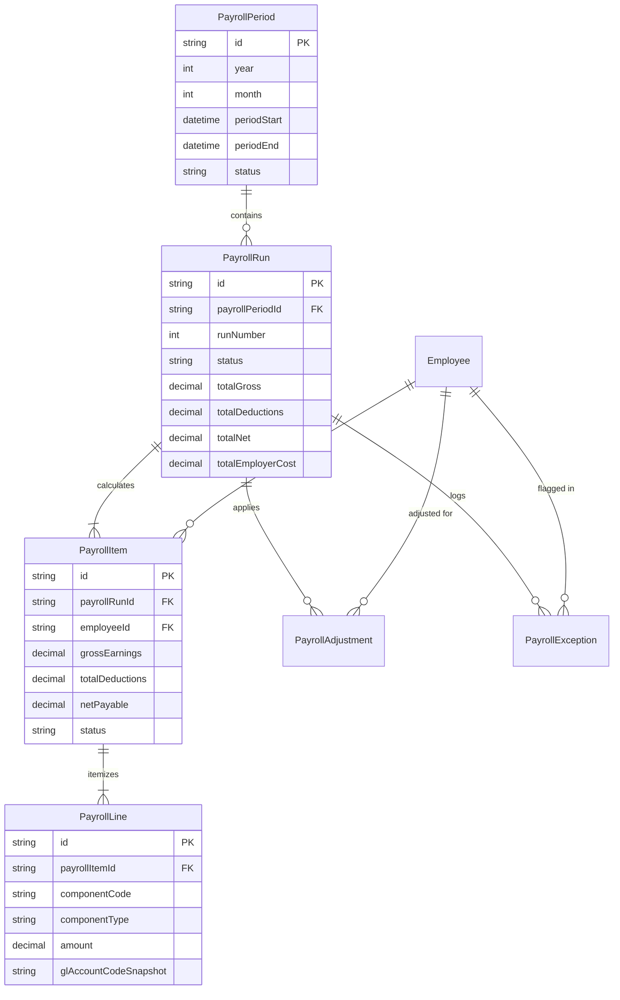

# Phase 3: Database Schema & Relational Specifications

**Document**: Phase 3 Implementation — PostgreSQL / Prisma Data Architecture  
**Status**: ACTIVE & MIGRATED

---

## 1. Relational Schema Architecture

---

## 2. Integrity & Deletion Rules

1. **`PayrollPeriod` $\rightarrow$ `PayrollRun`**: `onDelete: Restrict` prevents deletion of periods with existing calculation history.
2. **`PayrollRun` $\rightarrow$ `PayrollItem` $\rightarrow$ `PayrollLine`**: `onDelete: Cascade` enables clean, atomic draft run recalculations.
3. **`Employee` $\rightarrow$ `PayrollItem`**: `onDelete: Restrict` prevents deletion of employees who have historical payroll records.
